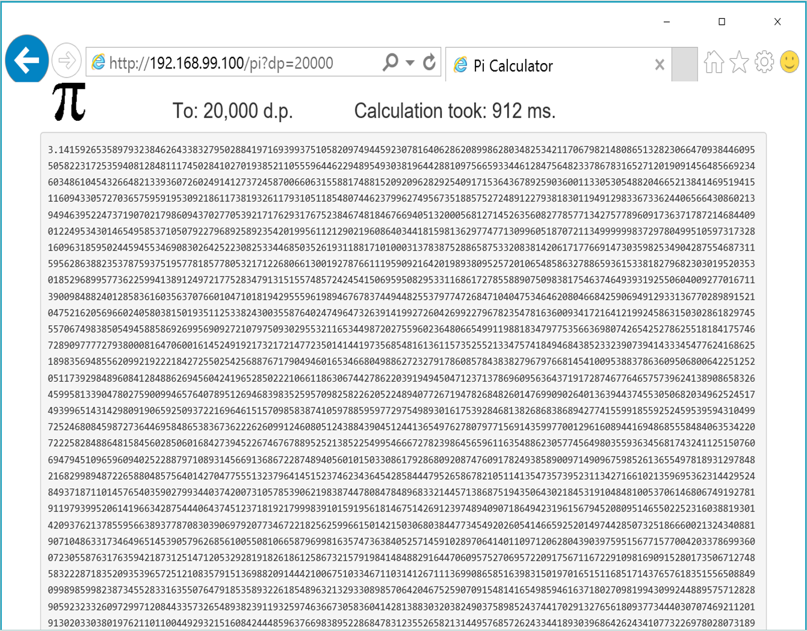

##Pi Web App

The source is for an ASP.NET Core web application, which calculates Pi.




### Pre-requisites

The app is built into a Docker container image on the Docker Hub, [sixeyed/pi-web-app](https://hub.docker.com/r/sixeyed/pi-web-app/), so to run it you just need Docker installed. The base image is Linux, so you'll need on either:

* [Docker for Windows](https://docs.docker.com/docker-for-windows/) - if you're running Windows 10, or
* [Docker Toolbox](https://www.docker.com/products/docker-toolbox) - for other versions.

Because the image has .NET Core installed, you don't need anything else on your machine to run the app.

If you want to build and run the app locally, you'll need:

* [.NET Core](https://www.microsoft.com/net/core)

And to poke around in the code, you can use any text editor, or:

* [Visual Studio Code](https://code.visualstudio.com)


### To run the app

Either:

```
docker run -d -p 80:5000 sixeyed/pi-web-app
```

And browse to http://localhost (or if you're using Docker Toolbox, find the IP address of the VM running Docker with `docker-machine ip`). You can specify the number of decimal places to calculate to in the querystring - http://localhost/pi?dp=10000. 

Or: 

```
cd source
dotnet restore
dotnet run
```

Then the app will be running at http://localhost:5000.


### Recreate the session in your own home

Slides are on SlideShare: [.NET Core at Scale with Docker Swarm]().

You'll need a Docker Swarm running, and the easiest way is to get on the [Docker for Azure](https://beta.docker.com/docs/azure/) beta programme. Failing that, my blog post [Production Docker Swarm on Azure: Why You Should Use PowerShell and Docker Machine](https://blog.sixeyed.com/production-docker-swarm-on-azure-why-you-should-use-powershell-and-docker-machine/) is a good starting point.

And then you can go through the [Demo Cheatsheet](demo-cheatsheet.md).


###Acknowledgements

I don't know how to calculate Pi. All the Math code came from [Lincoln Atkinson](http://latkin.org/blog/)'s very nice post [How to Calculate 1 Million Digits of Pi](http://latkin.org/blog/2012/03/20/how-to-calculate-1-million-digits-of-pi/). There's a good explanation of the process there, and the code is a straight port into .NET Core in my source code.


###Next

[Follow @EltonStoneman on Twitter] - anything about upcoming sessions, books, code samples and [my Pluralsight courses](https://www.pluralsight.com/authors/elton-stoneman) goes there. There's also [my blog](https://blog.sixeyed.com).

