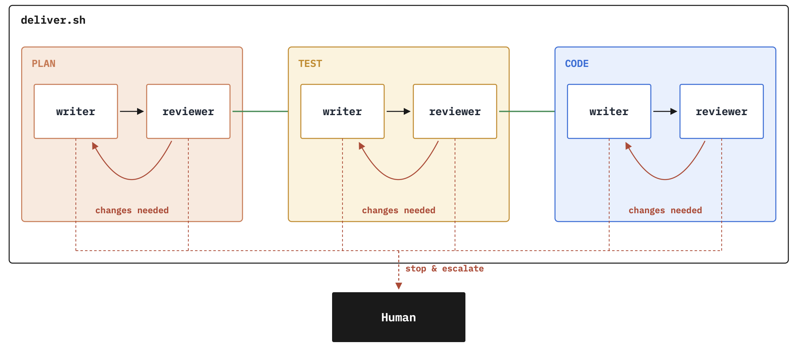

# Demo: AI Delivery Team

## Pre-reqs

- Docker running

## Start the team

We have an issue ready to go:

> [issue-005.md - Direct Messages](../../../../../manning/caw-project/docs/issues/005.md)

This script starts the team:

```pwsh
scripts/deliver.sh docs/issues/005.md
```

Where each phase is worked on by a pair of agents:



- agents are tuned to their role
- writer and reviewer could use different models
- reviewer can send back to the writer with notes
- each stage produces a markdown report
- later stages can send back to previous stages
- human escalation is a last resort